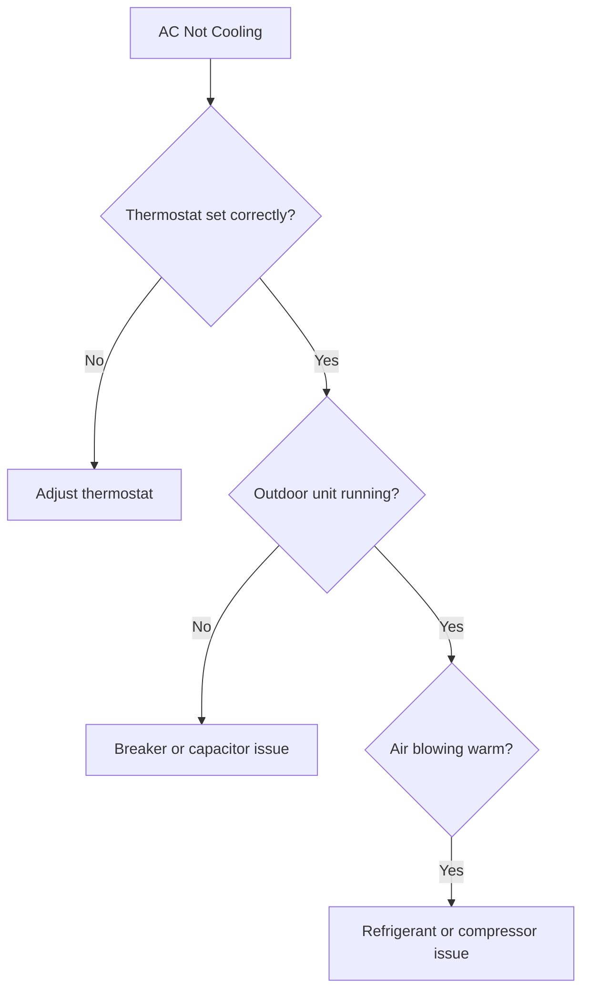
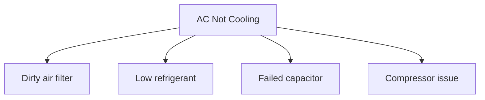

# Mermaid Diagram Generation Rules

AI must produce **two diagrams only** for symptom/condition pages.

## Diagram 1 — Symptom Verification (Diagnostic Flowchart)

Helps the reader verify the symptom and narrow down causes through yes/no questions.

**Example:**

**Rules:**
- Start with symptom name as root node
- Use diamond `{...}` for yes/no questions
- Use `-->|No|` and `-->|Yes|` for branches
- Keep compact (4–8 nodes)
- Use `flowchart TD` (top-down)

## Diagram 2 — Root Cause Tree

Shows symptom → causes as a flat tree (no branching logic).

**Example:**

**Rules:**
- Root = symptom
- Children = causes (3–6)
- Use `graph TD` or `flowchart TD`
- Node labels: escape brackets `[` `]` in text
- Keep node text short (2–4 words)

## Output Field Names

- `diagnostic_flowchart` or `diagnostic_tree_mermaid` → Diagram 1 (verification)
- `root_cause_flowchart` or `mermaid_graph` → Diagram 2 (cause tree)
